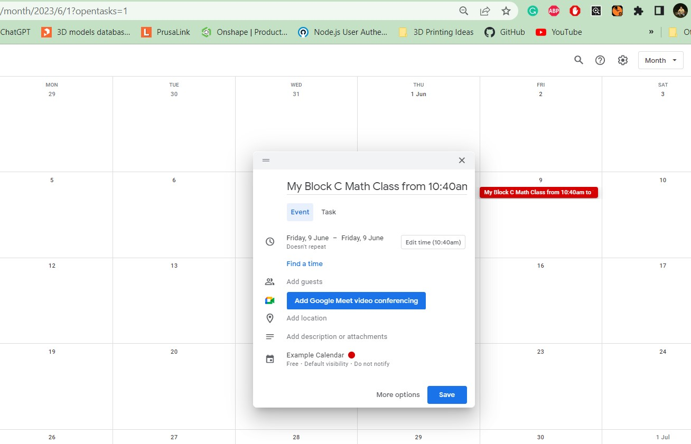

# Block Time Automation

## A chrome extension to help convert block numbers into times for scheduling class bookings in Google Calendar

### Author: Michael Marsland
### Created: May 2023
### Version: 2.0

Click the below image to watch a demonstration of the project. Not seen in the video is the addition of an asterisk (\*) after the block letter. 
Ex) "Block C\*" becomes "Block C from 10:40am to 11:50am".

### Updates:
#### Version 2.0:
Modifies the behavior of the extension to automatically map the times of the class based on the block letter and given date from the hardcoded rotation schedule.