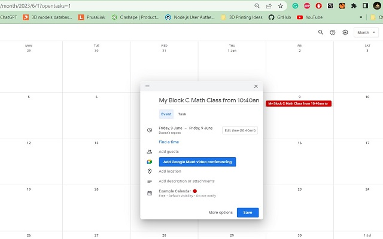

# Block Time Automation

## A chrome extension to help convert block numbers into times for scheduling class bookings in Google Calendar

### Author: Michael Marsland
### Created: May 2023
### Last Updated: June 2023
### Version: 3.0

Click the below image to watch a demonstration of the project (Month View):

(Week View):

### Updates:
#### Version 3.0:
Add the ability to use the extension from the "Week" view of google calendar.

#### Version 2.0:
Modifies the behavior of the extension to automatically map the times of the class based on the block letter and given date from the hardcoded rotation schedule.

### TODO:
#### Version 4.0:
- Convert an upload image of the schedule into a map for the block rotation (and save it in storage (options)) so the extension can be used every year without hardcoding